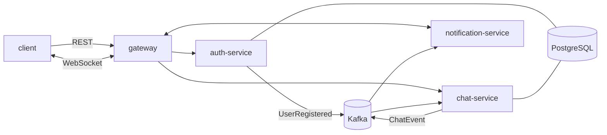

# chat-ws

A chat backend with real-time delivery over WebSocket, built as four Spring Boot services
around Kafka and the transactional outbox pattern.

This is a learning project, not a product. The service split is deliberately heavier than
the traffic justifies — a modular monolith would be the right call at this scale — and the
point was to work through the problems that only appear once state is split across
services: event ordering, at-least-once delivery, schema evolution, and reconnect
semantics. Every notable decision, including the ones that were reversed, is written down
in [docs/ARCHITECTURE.md](docs/ARCHITECTURE.md).

## Running it

```bash
docker compose build
docker compose up -d
docker compose ps        # all four services should reach "healthy"
```

Everything is reachable through the gateway on `http://localhost:8000`.

| Service | Port | Role |
|---|---|---|
| gateway | 8000 | routing, WebSocket proxy, CORS |
| auth-service | 8081 | registration, login, token rotation, JWKS |
| chat-service | 8082 | users, conversations, messages, read markers |
| notification-service | 8083 | WebSocket delivery |
| Apicurio Registry | 8080 | Avro schemas |
| kafka-ui | 8090 | topic and schema browser |
| PostgreSQL | 5433 | |

RSA keys for token signing live in `auth-service/keys/` and are not in the repository.
Generate a pair before the first run:

```bash
mkdir -p auth-service/keys
openssl genpkey -algorithm RSA -pkeyopt rsa_keygen_bits:2048 -out auth-service/keys/private.pem
openssl rsa -pubout -in auth-service/keys/private.pem -out auth-service/keys/public.pem
```

## How a message travels



A client sends a message over REST. chat-service writes the row and an outbox record in
one transaction, then wakes the publisher, which pushes a `ChatEvent` to Kafka keyed by
conversation id. notification-service consumes it and pushes a frame to every recipient's
open sockets.

Delivery over WebSocket is best-effort. The database is the source of truth, and a client
that missed frames catches up through `GET /api/conversations/{id}/messages` after
reconnecting. Both ends deduplicate.

## Decisions worth knowing about

Each of these is argued properly in [docs/ARCHITECTURE.md](docs/ARCHITECTURE.md).

- **Transactional outbox in both writing services**, woken after commit rather than only
  on a schedule — measured delivery dropped from up to five seconds to 68–156 ms.
- **One event envelope, seven payload types**, because a Confluent subject allows one
  schema per topic and duplicating shared fields across seven schemas is worse.
- **Events carry their recipients**, captured in the same transaction as the write, so
  notification-service keeps no replica of who is in which conversation.
- **notification-service is stateless** — no database, no Redis. Every instance consumes
  every event under its own consumer group and serves whichever sockets it holds, so
  scaling it needs no coordination and no shared session registry.
- **Foreign keys are values, not JPA associations.** No `@ManyToOne` anywhere, which
  removes N+1, cascades and `LazyInitializationException` by removing their cause.
- **Read state is a high-water mark**, one id per participant, moved forward only.
- **WebSocket clients authenticate with their first frame**, not at the handshake, because
  browsers cannot set headers on a WebSocket upgrade.
- **Redis exists only in auth-service**, where it holds information the database does not
  have. It was considered and rejected three times elsewhere.
- **Schema compatibility is enforced at `BACKWARD`**, which is what catches a union branch
  inserted in the middle instead of appended.

## Tests

Integration tests run against real PostgreSQL, Kafka and Apicurio through Testcontainers;
unit tests cover the pieces where logic is dense enough to isolate. Three bugs worth
mentioning were found by tests rather than by hand, all of which produced the same
symptom — a Kafka partition blocked forever — from three unrelated causes. The write-up
is in [docs/ARCHITECTURE.md](docs/ARCHITECTURE.md#consumer-resilience).

```bash
./mvnw test
```

Docker must be running; the first pass pulls container images.

## Known limits

Written out in full at the end of
[docs/ARCHITECTURE.md](docs/ARCHITECTURE.md#known-limits). The short version: the unread
counter is an honest `COUNT` that will not stay cheap, user search uses `LIKE` where it
should use trigrams, there is no presence and no WebSocket heartbeat, the gateway doubles
per-connection memory for every socket it proxies, and nothing watches the dead-letter
topic.

## Stack

| Technology | Version | Why |
|---|---|---|
| **Java** | 21 on JDK 25 | language level 21; the JDK 25 runtime is what makes virtual threads safe here — carrier pinning on `synchronized` was fixed in JDK 24 |
| **Spring Boot** | 4.1 | MVC with virtual threads in the three services |
| **Spring Security** | 7.1 | each service is its own OAuth2 resource server |
| **Spring Cloud** | 2025.1.2 | gateway only; Boot 4.1 needs this patch release or newer |
| **Hibernate** | 7.4 | no JPA associations anywhere — foreign keys are plain values |
| **PostgreSQL** | 17 | one instance, a schema per service |
| **Flyway** | | migrations, `ddl-auto: validate` |
| **Kafka** | 4.0, KRaft | one topic per producing service |
| **Avro** | | event contracts, generated at build time |
| **Apicurio Registry** | 3.0.6 | schema registry, compatibility pinned to `BACKWARD` |
| **Redis** | 7 | auth only — a 30-second grace window for refresh-token rotation |
| **Jackson** | 3 (`tools.jackson`) | Boot 4's default |
| **Testcontainers** | | real PostgreSQL, Kafka and Apicurio in integration tests |
| **JUnit** | 6 | with Mockito and AssertJ |

## API

Full endpoint tables, status codes and the WebSocket frame protocol are in
[docs/ARCHITECTURE.md](docs/ARCHITECTURE.md#api-surface).
